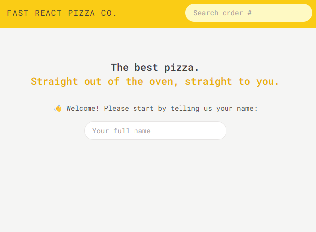
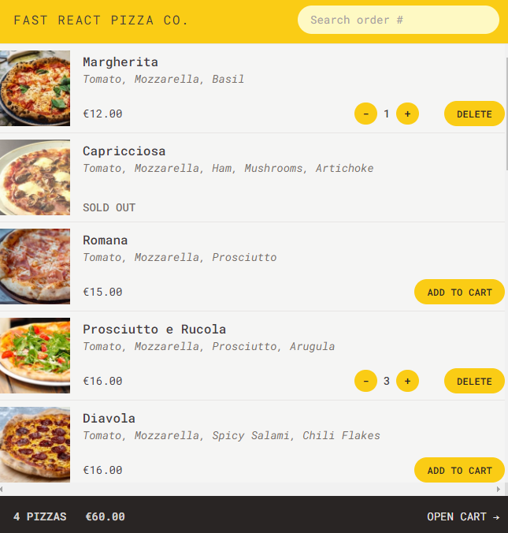
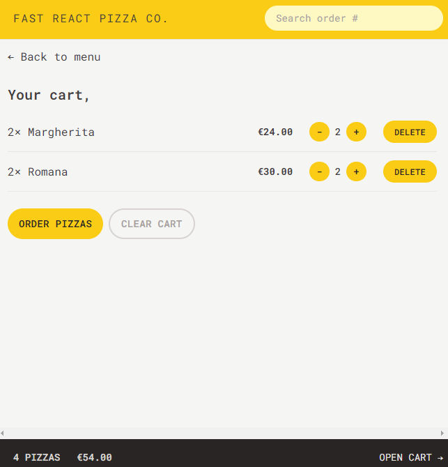
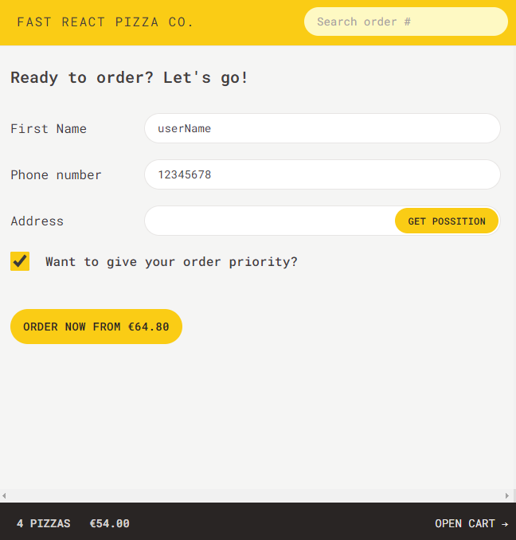
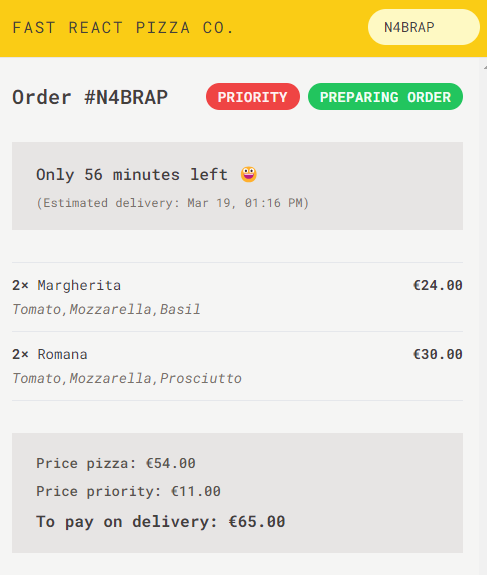

# Fast React Pizza Co.

A simple Pizza Ordering App.

## Description

Fast React Pizza Co. is a dynamic web application designed for pizza lovers who appreciate the ability to customize their orders with ease. Built with React, Redux, and integrated with Redux Persist for a seamless user experience, this application offers a range of functionalities from customizing pizzas to placing and editing orders with a unique PIN system.

## Features

Menu Exploration: Users can browse through a variety of pizza options, each with detailed descriptions and pricing.
Dynamic Cart Management: Add pizzas to the cart, adjust quantities, or remove them entirely with instant updates to the order total.
Persistent Cart Data: Leveraging Redux Persist, the application ensures that your cart remains intact even after closing the browser, providing a hassle-free return to your session.
Priority Orders: Mark your order as “priority” for an additional 20% of the cart price and we’ll get your pizza to you as fast as possible.
Post-Order Modifications: Changed your mind? You can mark your order as “priority” even after it has been placed.
Payment on Delivery: No need to enter credit card information. Just pay when your pizza arrives.
Unique Order ID: Every order gets a unique ID, so you can easily look up your order later.
Responsive Design: Crafted with a mobile-first approach, ensuring a smooth experience across all devices.

### Pages

Homepage: /
Pizza Menu /menu
Cart: /cart
Placing a new order: /order/new
Looking up an order: /order/:orderID

#### State Management

User: Global UI state (No accounts)
Menu: Global remote state (Menu fetched from API)
Cart: Global UI state
Order: Global remote state (Fetched and submitted to API)

### Technical Stack and Dependencies

Fast React Pizza Co. is built using a modern JavaScript stack, leveraging the capabilities of React, Redux, and Vite among other tools to provide a fast and responsive user experience. Below is an overview of the key technologies and libraries used in this project:

Routing: React Router
Styling: TailwindCSS
Persist Remote State Management: React Router
UI State Management: Redux Toolkit

Development Tools
ESLint & Prettier: Used to enforce coding standards and format code consistently.
Tailwind CSS: A utility-first CSS framework for rapid UI development.

Geocoding API:
Address Verification: Automatically verify and correct addresses entered by users during the ordering process, ensuring accurate delivery locations.
Location-based Services: Provide users with information and services relevant to their location, enhancing their overall experience.

#### Getting Started

Prerequisites

Node.js and npm (Node Package Manager)
Basic knowledge of React and Redux

Installation

Clone the repository to your local machine:
bash
Copy code
git clone https://github.com/yourusername/fast-react-pizza-co.git
cd fast-react-pizza-co

Scripts

npm run dev: Runs the application in development mode with hot reloading.
npm run build: Builds the app for production to the dist folder.
npm run lint: Lints the project files using ESLint.
npm run preview: Serves the production build locally for previewing

Install dependencies:
npm install

Start the development server:
npm run dev
This will launch the application in your default browser at http://localhost:5173/.
